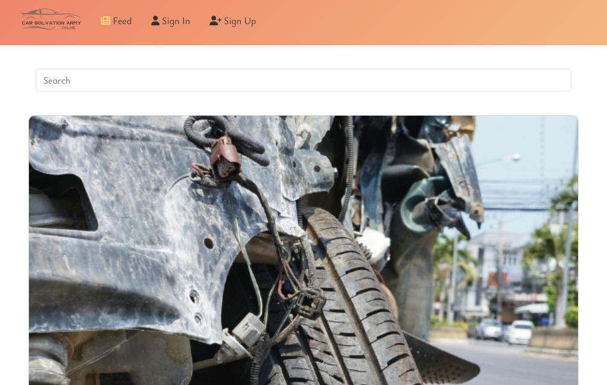

# **[Car Solution Army](https://pp5-react-3a1a7789b87e.herokuapp.com/)**

**CSA** was developed and submitted as the fifth and final Portfolio Project as part of the Advanced Frontend specialization for Code Institute's Diploma in full-stack software development.

# 

This project marks the introduction of a diverse range of features and functionalities designed to enrich the experience of users passionate about DIY car maintenance, inspired by my previous work with similar blogs, sites and tutorials. CSA is a virtual hub tailored for a vibrant community of DIY car enthusiasts, specifically those dedicated to resolving issues and sharing knowledge about various car models and repair techniques.

In contrast to its earlier iterations, this platform now offers a more immersive and interactive experience, aiming to serve as the ultimate social media platform exclusively crafted for individuals interested in DIY car repairs. It stands as a unique offering, as it appears to be the sole online space dedicated to empowering DIY car enthusiasts to collaborate and learn from one another's experiences.

The platform not only fulfills the existing demand for learning and interactive engagement among those passionate about DIY car maintenance but also strives to amplify that demand. It serves as a rare opportunity for users to establish and nurture their very own distinct online community. Here, members are encouraged to share their challenges, seek solutions, and collaboratively troubleshoot a myriad of car-related problems. The platform thrives on the spirit of camaraderie, where DIY enthusiasts unite to enhance their skills and contribute to a thriving community of car fixers.

- Deployed website **[Here](https://pp5-react-3a1a7789b87e.herokuapp.com/)**

- View the backend repository on Github **[Here](https://github.com/JacquesIversen/api-rest-for-final-pp5)**.

## Contents

- **[Agile Development Process](#agile-development-process)**

  - **_[Epics](#epics)_**
  - **_[User Stories](#user-stories)_**
  - **_[MoSCoW](#moscow)_**

- **[Design](#design)**

  - **[Typography](#typography)**
  - **[ColorScheme](#colorscheme)**

- **[Features](#features)**

  - **[Main Features](#mainfeatures)**
  - **[Features for the future](#features-for-the-future)**

- **[Testing](#testing)**

- **[Deployment](#deployment)**

- **[Technologies used](#technologies-used)**

- **[Credits](#credits)**

### User Stories for Car Community Sharing Platform:

## [Agile Development Process](#agile-development-process)

### [Epics](#epics)

- Epic 1: Basic Setup
  - Make sure react is installed landing page is successfull.
  - Mapping directory, and creating folders, files etc.
  - Installing Packages to withhold thought design.

---

- Epic 2: Creating users and Admin.
  - Reacing DrfAuth installation
  - Reaching Superuser
  - Testing Api is responding
  - Creating MockUsers

---

- Epic 3: Creating Content/Issues
  - Displaying admin created content
  - Displaying User created content
  - CRUD functionality on Content.
  - Bug solvering

---

- Epic 4: Creating Comments
  - Displaying admin created Comments
  - Displaying User created Comments
  - Creating front-end design for the user
  - Creating User content
  - CRUD functions

---

- Epic 5: Creating Likes/unlike for Comments
  - Display admin created likes and unlikes
  - Display user created likes and unlikes
  - Bug solvering
  - CRUD Functions

---

- Epic 6: Designing user profile:
  - Fetching, and displaying user profile
  - CRUD Functions
  - Avatar reassuring in used placements

---

- Epic 7: Testing:
  - Manual Testing
  - Testing Documentation
  - Readme

---

- Epic 8: Deployment and Documentation
  - Deployment
  - Documentation

---

- Epic 9: Testing:
  - Manual Testing
  - Testing Documentation
  - Bug fixes

---

## [**User Stories**](#user-stories)

#### **Navigation:**

- As a user, I can view a navigation bar on every page so that I can easily navigate between different sections of the platform.

#### **Routing:**

- As a user, I can navigate through pages quickly without page refresh so that I can seamlessly access different content.

#### **Authentication - Sign Up:**

- As a user, I can create a new account to access all features available to registered users and actively participate in the car community.

#### **Authentication - Sign In:**

- As a user, I can sign in to the platform to access functionalities specific to logged-in users, enabling me to engage fully with the community.

#### **Authentication - Logged In Status:**

- As a user, I can easily identify whether I am logged in or not, ensuring I have access to the relevant features and information.

#### **Authentication - Refreshing Access Tokens:**

- As a user, I can maintain my logged-in status until I choose to log out, ensuring a seamless experience without constant interruptions.

#### **Navigation: Conditional Rendering:**

- As a logged-out user, I can see sign-in and sign-up options, providing me with the means to join the community or access my account.

#### **Avatar:**

- As a user, I can view avatars of other users, facilitating easy identification and interaction within the car community.

#### **Profile:**

- **Profile Page:**
  - As a user, I can view other users’ profiles to learn more about their car-related posts and experiences, fostering a sense of community.
- **View User Data:**
  - As a user, I can access information about other users, including the number of posts, allowing me to better understand their contributions.
- **View All issues posted by a Specific User:**
  - As a user, I can view all posts by a specific user, helping me catch up on their latest contributions and decide whether to follow them.
- **Update Username and Password:**
  - As a logged-in user, I can update my username and password, ensuring my profile remains secure and reflecting any desired changes in my display name.

#### **Sharing Car-related Content:**

- **Create Issue:**
  - As a logged-in user, I can create issues with images, sharing my car-related experiences, issues, and solutions with the community.
- **View an issue:**
  - As a user, I can view the details of a single issue to learn more about specific car-related topics or discussions.
- **Topic Page:**
  - As a user, I can view the Topic page, allowing me to read comments and engage in discussions about the topic/issue.
- **Edit Issue:**
  - As a post owner, I can edit my full issue, and all details within. Enabling me to make corrections or updates to my content after it was created.
- **Create a Comment:**
  - As a logged-in user, I can add comments to a issue, sharing my thoughts, insights, or solutions related to the content.
- **Comment Date:**
  - As a user, I can see the timestamp of comments, providing context about the comment's recency and relevance.
- **View Comments:**
  - As a user, I can read comments on posts, gaining insights into other users' perspectives and solutions related to the post's topic.
- **Like and dislike Comments:**
  - As a user, I can up- and downvote comments, related on their effect the issueowner might have.
- **Delete Comments:**
  - As a comment owner, I can delete my comments, allowing me to control the removal of my contributions from the platform.
- **Edit a Comment:**
  - As a comment owner, I can edit my comments, ensuring I can refine or update my existing contributions.

#### **Car Profile:**

- **Create and Edit Car Profile:**
  - As a logged-in user, I can create and edit my car profile, including adding and changing images of my car, as well as providing information about my vehicle.
- **View Other User's Car Profiles:**
  - As a logged-in user, I can view other users' car profiles if I am following them, enabling me to explore different car models and modifications within the community.
- **Search Car Profiles:**
  - As a user, I can search for car profiles using keywords, allowing me to find specific car models or modifications that interest me.
- **Infinite Scroll:**
  - As a user, I can keep scrolling through car profiles, with content loading automatically, ensuring a seamless browsing experience without the need to navigate to the next page.

#### **Car Repair and Maintenance Details:**

- **Create and Edit Repair Details:**
  - As a logged-in user, I can create and edit repair details about my car, sharing my DIY experiences and solutions with the community.
- **View Other User's Repair Details:**
  - As a non Logged in user, I can view repair details of other users' cars, allowing me to learn from their experiences and solutions.
- **Search Repair Details:**
  - As a user, I can search for car repair details using keywords, helping me find specific DIY solutions or techniques shared by other community members.
- **Infinite Scroll:**

  - As a user, I can keep scrolling through repair details, with content loading automatically, ensuring a seamless browsing experience without the need to navigate to the next page.

### [MoSCoW](#moscow)

- Must have:

  - User Authentication: Users can create an account, sign in, and sign out.
  - User Profiles: CRUD functionality for users to personalize their presence on the website through profile pages.
  - Feed/Landing Page: Users can view a list of issues.
  - Users can create and update issues as they like.
  - Comments: Users can view & comment to a specific issue, without compromising the simplicity of the feed.
  - Searchbar: Users can search for specific types of issues, to allow them to find a solution to their problem.
  - Alert messages when users are creating/making critical actions
  - Readme
  - Test-cases
  - Provide feed with realistic userissues, comments and likes:

- Should Have:

  - Solved/NotSolved: Issue owner can mark the issue as solved, and hence drop the importance of the issue.
  - Infinite scroll.
  - Interactiveness: Give the user an impression of an avtive (living site)
  - Notifications when user action is deployed, or nulled

- Could Have:

  - Bumps/Likes to the Issue element: Give the User an opportunity to track issues they might have interest in.
  - List-Filter method: Provide users a neat headline overlook.
  - Media library/gallery in the issue module: Allow users to add multiple pictures, to better provide a understanding of problems.
  - Comments answering comments

- Wont Have
  - Seperate API containing a VIN-Number Library
  - Mediafiles, videoupload: Provide users an opportunity to upload videos and

## [Design](#design)

The purpose of the design was to create a totally independent layout than teached in the CI-Moments module. All new files are therefore not containing any boilerplate code:
Its thought for the project to follow same structure backend as the moments project, but a more interesting color scheme in the design.
Using React Bootstrap classes as the main functionality to provide reponsiveness, if not entirely achievable. mediascreen is added in a linked .module.css file.

Giving this project follows a facebook/twitter principle its important for the design to not wander away from the landingpage simplicity.

### Landing Page

# 

On the Landing page, users are met with a very simple objective, who need no explanation. Its very easy to understand the purpose of the site, when the content provided by the users are correct. A very simple Navbar gives you only 3 options, to either sign in, sign up or check the feed. Its decided to not have the navbar present with the user at all time.

Logged In the Navbar will give you following options:

- Feed
- Post an Issue Now
- My profile
- Sign out
- Greeting

### Feed

# 

In the feed a searchbar will stay at the top, for users to use when needed. The feed do not contain any user info, brand/model infomation, but only a date, providing a recent feel to the user and a comment counter to help users understand the activity’s this issue might have had. The description of the issue is displayed in full length, so users wont have to enter the Issue to understand the problem displayed. A infinity scroll feature is added to keep rendering posts. The only filter method added is sorted from newest post.

### SignIn/SignUp

# 

# 

Sign in & Sign Up forms follow same structure to present users a very simple experience. An enginebay background set the mood for how this site is supposed to be.

### My Profile

# 

When Signed in, users are takes straight to their Profile Page. Here they will have the option to edit their name, write a small biography and change/add a profilepicture. All users will have a default picture, when a new user is created.

They will too have all issues they might have posted displayed, along with comments they might have written/posted

### Create an Issue

# 

In this part of the site, users are required to furfill image, title, manufacturer, model, year & description. when posted, users are taken straight towards the issuepage of their newly posted issue. Placeholdertext encourage the user to actually be accurate when posting an issue.

### Issue Page

# 

### [Typography](#typography)

This project utilizes the following fonts:

- Days One: This font is used across the application for general text. It can be found at
- Google Fonts.
  Kdam Thmor Pro: This font is also used across the application. It can be found at Google Fonts.

Background-colors:

- #f8f8f8
- #ff7e5f
- #30e0e0
- #f8f9fa

Text colors will differ in contrast to background and buttons, between white and black.

Containers/boxes uses somewhat similar shadow and border/radius principles with very few differences.

### Features:

- Alot of thought about features had to be cut due to an excessive amount of trouble fetching API information. This caused the timespan of the project to really slip, and therefore compromise the functionality of the site.

- React Library’s provided a list of reusable components. Functionality was provided by CI - Moments tutorial .

  - Asset.js
  - Avatar.js
  - MoreDropDown.js
  - Navbar.js
  - NotFound.js

### Future Features:

- This project would love a wider functionality. Perhaps this would be in the kind of a seperate model, allowing users to add their online vehicle inventory. This inventory giving the user a credential part of the troubleshooting in the feed.

- Adding a spareparts API/Shop, to allow users to provide insite links to parts who've helped their issue:

- Implement all Could haves:

## Testing

- Manual Testing:

  Manual testing of every feature, component and page was conducted on an ongoing basis throughout development. All test cases performed as intended and passed. The most important of these, regarding users being able to Create, Read, Update and Delete data, included:

  Overlays
  Tooltips
  forms
  search bars
  links
  dropdown menus
  redirects
  authentication
  ownership
  toggles
  buttons
  uploading images

Test file here: (LInk)

Tools for testing:

- Chrome Devtools:
- Blackbox

## Deployment

Heroku was used to deploy this project by the following these steps:

- Create or log in to your account on Heroku.com
- Click "New" and select "Create new app", then add a unique app name and choose your region
- Click on create app
- Push your changes to GitHub
- Push the code to Heroku using the command git push Heroku main
- Log in to heroku.com and open the dashboard for your React application (this is separate from the Django Rest Framework application that runs the API). In settings, make sure that the 'Config Vars' match the env.py file and that DEBUG and DEVELOPMENT are set correctly.
- Before Selecting the “Deploy” tab in the dashboard, add 'Python' to the 'buildpack' if not already present.
- Connect to Github, the relevant repository and choose the correct branch before clicking on “Deploy Branch”
- When you see the message “deployed to Heroku” in the build log, click the “open app” button at the top of the page.

## Technologies used

#### Languages

- HTML/JSX
- CSS
- JavaScript
- Libraries, frameworks and dependencies

- React was the core library used for building this website.

- React Router handled the navigation between views and components.

- React Infinite Scroll was used for to load content as the user scrolls down the page.

- Axios is used here to make the HTTP requests and handle data fetching.

- React Bootstrap provided the pre-built UI components described above.

- Font Awesome allowed me to use scalable vector icons which add value to the UX.

- Cloudinary is the cloud-based image and video management platform used.

- VS-Code / GitPod

- Github

- ElephantSql

- Heroku

Credits:

- CI, Moments and drf-api walkthrough projects
- W3School
- Youtube Creators:

  - Adrian Twarog:
  - Keep Coding
  - UIBrains Technoligies
  - Programming with Mosh
  - WebDevSimplefied

- My girlfriend for providing me a sharp and informative practical Agile process understanding. And for helping me setting up, using and trusting a Jira-Board.
